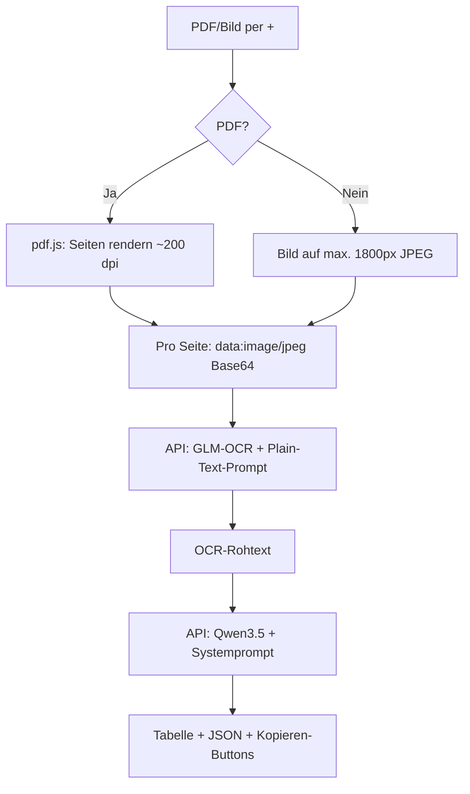

# Rechnung OCR — Ablauf im Playground

Use Case: **Rechnung OCR** (`invoice-ocr`)  
Kategorie: Delivery & QA  
Pipeline: **GLM-OCR** (Texterkennung) → **Qwen3.5 122B** (Strukturierung)

---

## Kurzüberblick

Der Use Case nutzt eine **Zwei-Stufen-Pipeline**:

1. **GLM-OCR** — liest nur Text aus dem Dokument (OCR, Rohtext)
2. **Qwen3.5** — strukturiert den Rohtext in Rechnungsfelder (Tabelle, JSON, Kurztext)

**Wichtig:** GLM-OCR bekommt **nie** die Aufgabe „Extrahiere Rechnungsnummer als JSON“. Es erhält nur den Plain-Text-Prompt `Extract all text from this document.` Die Feld-Logik übernimmt Qwen in Stufe 2.

Das umgeht ein bekanntes Problem: Direkte JSON-Feld-Extraktion an GLM-OCR liefert bei Rechnungen oft leere oder vertauschte Kopfdaten (Rechnungsnummer, Absender, Empfänger).

---

## Nutzung in der UI

1. Use Case **„Rechnung OCR“** wählen → Modell wird auf **Qwen3.5 122B** gesetzt (für Stufe 2).
2. **PDF oder Bild** per **+** anhängen (Pflicht).
3. Optional Hinweise ergänzen (z. B. „Freenow-Taxirechnung“).
4. **„Rechnung extrahieren“** klicken.

Fortschritt im Composer:

- *Dokument wird vorbereitet …*
- *Texterkennung (GLM-OCR) …*
- *Strukturierung (Qwen) …*

Nach der Antwort: **Kopieren-Buttons** für JSON und Kurztext für die Buchhaltung.

---

## Technischer Ablauf



### Schritt 0 — Validierung

- Ohne Anhang: Fehlermeldung (*„Bitte eine Rechnungs-PDF oder ein Bild per + anhängen.“*).
- Nur Text ohne Datei reicht nicht — der Use Case ist dokumentenzentriert.

### Schritt 1 — Dokument vorbereiten (nur im Browser)

Die Datei wird **nicht** als PDF an die KI gesendet.

**Bei PDF:**

- [pdf.js](https://mozilla.github.io/pdf.js/) öffnet die Datei lokal im Browser.
- Jede Seite wird mit **~200 dpi** auf ein Canvas gerendert (Skalierung `200 / 72`).
- Ergebnis: JPEG als `data:image/jpeg;base64,…`
- Maximal **10 Seiten** pro Lauf (mittwald erlaubt 30; der Playground bleibt konservativ wegen Request-Größe).
- Ist eine Seite zu groß (> ca. 520 KB Base64), wird die Auflösung automatisch reduziert.

**Bei Bild (JPG/PNG):**

- Direkt als JPEG, Kantenlänge max. **1800 px** (höher als normale Vision mit 1024 px).

**Warum nicht PDF direkt an GLM-OCR?**

| Grund | Erklärung |
|-------|-----------|
| Server-Policy | Der Playground-Proxy erlaubt nur `data:image/…`, kein `data:application/pdf`. |
| Bessere Kopfzeilen | Gerenderte JPEGs liefern Rechnungsnummer, Kunde und Absender zuverlässiger als PDF über den mittwald Document-Proxy. |

Relevante Dateien: `client/src/pdfToOcrImages.ts`

### Schritt 2 — Texterkennung mit GLM-OCR

Request über `POST /api/chat/completions` (Browser → Playground-Server → mittwald AI Hosting):

| Parameter | Wert |
|-----------|------|
| Modell | `GLM-OCR` |
| Prompt | `Extract all text from this document.` |
| `temperature` | `0.1` |
| `top_p` | `1.0` |
| Inhalt | Alle Seitenbilder als `image_url` + Text-Prompt |

`GLM-OCR` ist ein **internes Modell** — es erscheint nicht im Modell-Dropdown, der Server erlaubt es dennoch für diese Pipeline (`INTERNAL_PLAYGROUND_MODELS` in `server/src/index.js`).

Antwort: **Rohtext** — Zeile für Zeile, wie auf der Rechnung sichtbar (Name, Rechnungsnummer, Beträge, Fußnoten …).

Relevante Dateien: `client/src/invoiceOcr.ts`, `client/src/modelPresets.ts` (`MODEL_GLM_OCR`)

### Schritt 3 — Strukturierung mit Qwen3.5

Der OCR-Text erscheint **nicht** in der sichtbaren Chat-Nachricht. Intern baut der Playground eine Nutzer-Nachricht für die API:

```text
Bitte strukturiere die folgenden OCR-Rohdaten einer Rechnung.
Quelldatei: rechnung.pdf
Nutze nur Informationen aus dem OCR-Text — nichts erfinden. Fehlende Felder als null.

Zusätzlicher Kontext vom Nutzer:
[Falls angegeben]

--- OCR-Text (GLM-OCR) ---
[voller Rohtext]
--- Ende OCR-Text ---
```

Dazu der **Systemprompt** (`INVOICE_OCR_SYSTEM_PROMPT` in `client/src/playgroundUseCases.ts`) mit Regeln:

- Nur Fakten aus dem OCR-Text
- Leistungserbringer vs. Empfänger vs. Vermittler trennen
- Fehlende Felder → `null` oder `[nicht erkannt]`

Qwen antwortet (gestreamt) mit:

- **Kurzfassung**
- **Markdown-Tabelle** (Feld | Wert)
- **Positionen**
- **Hinweise & Unsicherheiten**
- Kopierbare Blöcke: **Rechnungsdaten (JSON)** und **Kurztext für Buchhaltung**

### Schritt 4 — Was im Chat sichtbar ist

| Rolle | Inhalt |
|-------|--------|
| Nutzer | Dateiname + optionale Hinweise (nicht der OCR-Rohtext) |
| Assistent | Strukturierte Auswertung von Qwen |
| UI | Kopieren-Buttons über den Codeblöcken |

Orchestrierung: `client/src/App.tsx` (eigener `send`-Zweig für `invoice-ocr`)

---

## API-Sequenz

```text
Browser                    Playground-Server              mittwald AI Hosting
   |                              |                              |
   |-- PDF rendern (lokal) ------>|                              |
   |-- POST /api/chat/completions |-- GLM-OCR ------------------>|
   |<-- OCR-Rohtext --------------|<-----------------------------|
   |-- POST /api/chat/completions |-- Qwen3.5 (SSE stream) ----->|
   |<-- strukturierte Antwort ----|<-----------------------------|
```

Pro Extraktion: **zwei** Chat-Requests → zwei Einträge im Rate-Limit für `/api/chat/completions`.

---

## Warum dieser Ansatz funktioniert

| Ansatz | Problem |
|--------|---------|
| GLM-OCR + „Gib JSON mit Rechnungsnummer …“ | Modell interpretiert statt zu lesen → leere/falsche Felder, Rollen vertauscht |
| PDF direkt als Data-URI | Server blockiert; Proxy-Rendering schwächer bei Kopfzeilen |
| **PNG/JPEG ~200 dpi + Plain-Text-OCR + Qwen** | Voller Text inkl. Kopfzeile → Qwen mappt Felder zuverlässig |

**Merksatz für Teams:**

> GLM-OCR nur zum **Lesen**, Qwen zum **Verstehen** — und PDFs vorher im Browser in scharfe JPEGs rendern, nicht als PDF an die API schicken.

Referenz: [GLM-OCR — mittwald Developer Portal](https://developer.mittwald.de/docs/v2/platform/aihosting/models/glm-ocr/)

---

## Grenzen & Annahmen

- **Max. 10 PDF-Seiten** pro Lauf (`OCR_MAX_PAGES` in `pdfToOcrImages.ts`)
- **Request-Größe** — Server-Limit `MAX_BODY_BYTES` (Standard 10 MB); GLM-OCR läuft **pro Seite** einzeln; große Seiten werden komprimiert
- **Kein PDF-Textlayer** — auch bei digitalen PDFs läuft alles über OCR (einheitlicher Workflow; für reine Text-PDFs wäre serverseitiges `pdftotext` schneller, ist aber bewusst nicht eingebaut)
- **GLM-OCR** muss nicht in `PLAYGROUND_ALLOWED_MODELS` stehen (intern freigegeben); optional in `.env.example` dokumentiert

---

## Relevante Dateien im Repository

| Datei | Rolle |
|-------|--------|
| `client/src/playgroundUseCases.ts` | Use-Case-Definition, Systemprompt, Schritte |
| `client/src/pdfToOcrImages.ts` | PDF → JPEG, Bild-Kodierung |
| `client/src/invoiceOcr.ts` | GLM-OCR-Aufruf, Nachricht für Qwen |
| `client/src/App.tsx` | Send-Pipeline, UI-Fortschritt, PDF-Upload |
| `client/src/PlaygroundUseCaseGuide.tsx` | Hinweis PDF/Bild per + |
| `server/src/index.js` | `GLM-OCR` als internes Modell erlauben |

---

## Empfohlene Parameter (mittwald-Doku)

Für GLM-OCR:

| Parameter | Wert |
|-----------|------|
| `temperature` | `0.1` |
| `top_p` | `1.0` |
| `max_tokens` | ca. 4096 pro Seite (im Playground: `min(4096 × Seiten, 16384)`) |

Für Qwen3.5 (Strukturierung): Non-Thinking-Preset aus `getInferencePreset` — `enable_thinking: false`, Temperature 0.7 (Use-Case nutzt Doku-Preset beim Strukturierungs-Schritt).
